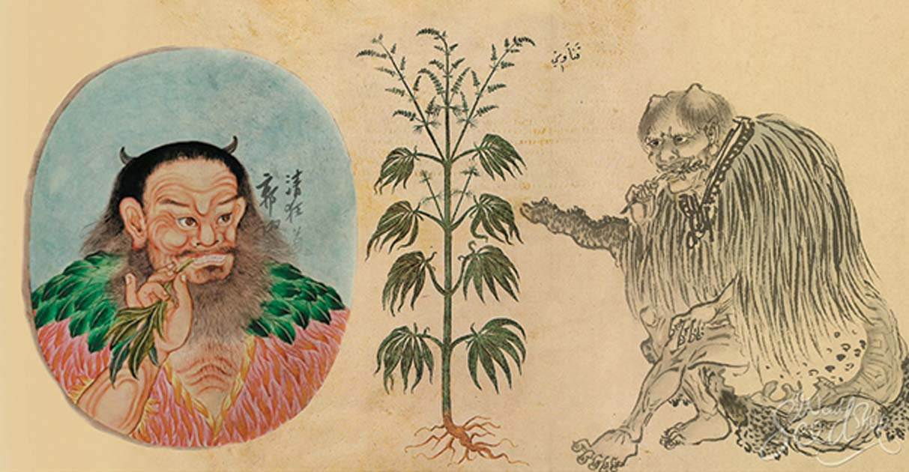
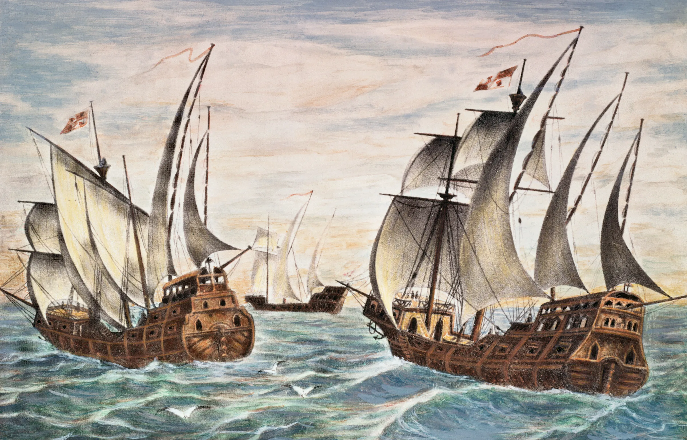
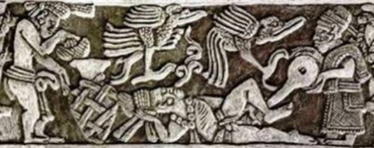

A história da maconha remonta a milhares de anos atrás, quando nossos ancestrais já estavam conectados com a natureza. Dizem que as primeiras civilizações a usar a planta foram as chinesas. Eles a cultivavam há mais de 5.000 anos, não apenas para fins medicinais, mas também para fazer papel, tecidos e até mesmo alimentos.

As antigas civilizações da Índia também têm uma história rica com a maconha. Lá, ela era considerada uma planta sagrada e fazia parte de rituais religiosos, especialmente na prática do hinduísmo. Eles acreditavam que a maconha tinha propriedades espirituais e medicinais.

Conforme o tempo passou, a maconha viajou por diversas regiões do mundo. Na África, por exemplo, algumas tribos também utilizavam a planta em rituais religiosos e cerimônias importantes.

Durante os séculos 14 a 16, o cânhamo era uma matéria-prima extremamente importante na Europa. Ele era amplamente cultivado e utilizado para produção de tecidos, cordas, velas, papel e muitos outros produtos essenciais da época. Suas fibras eram conhecidas por sua resistência e durabilidade, tornando o tecido de cânhamo uma escolha popular para várias aplicações.

Os europeus valorizavam o cânhamo principalmente por suas propriedades versáteis e sua capacidade de adaptação a diferentes necessidades. A produção de tecido de cânhamo foi fundamental para o desenvolvimento da indústria têxtil europeia naqueles séculos.

As velas feitas de cânhamo eram amplamente utilizadas nas embarcações da época, pois eram mais resistentes e confiáveis do que as velas de outros materiais. Além disso, o cânhamo era um componente importante para a produção de cordas, que eram usadas em diversas atividades, desde a construção de navios até a amarração de cargas.

Ao longo dos séculos 14 a 16, o cultivo de cânhamo foi incentivado em muitos países europeus, e algumas regiões até impuseram leis obrigando os agricultores a dedicarem uma parte de suas terras para o cultivo da planta.

Quando chegamos ao continente americano, encontramos registros de que as civilizações indígenas, como os astecas e os maias, também faziam uso da maconha em suas cerimônias e práticas religiosas. Além disso, a planta era valorizada por suas propriedades medicinais e como uma fonte de alimento.

É importante destacar que, ao longo da história, a maconha teve diferentes usos, dependendo da cultura e do contexto social. Algumas culturas a utilizavam para fins medicinais, como alívio da dor e tratamento de diversas enfermidades. Outras a utilizavam com fins recreativos ou espirituais.

 
 
 
