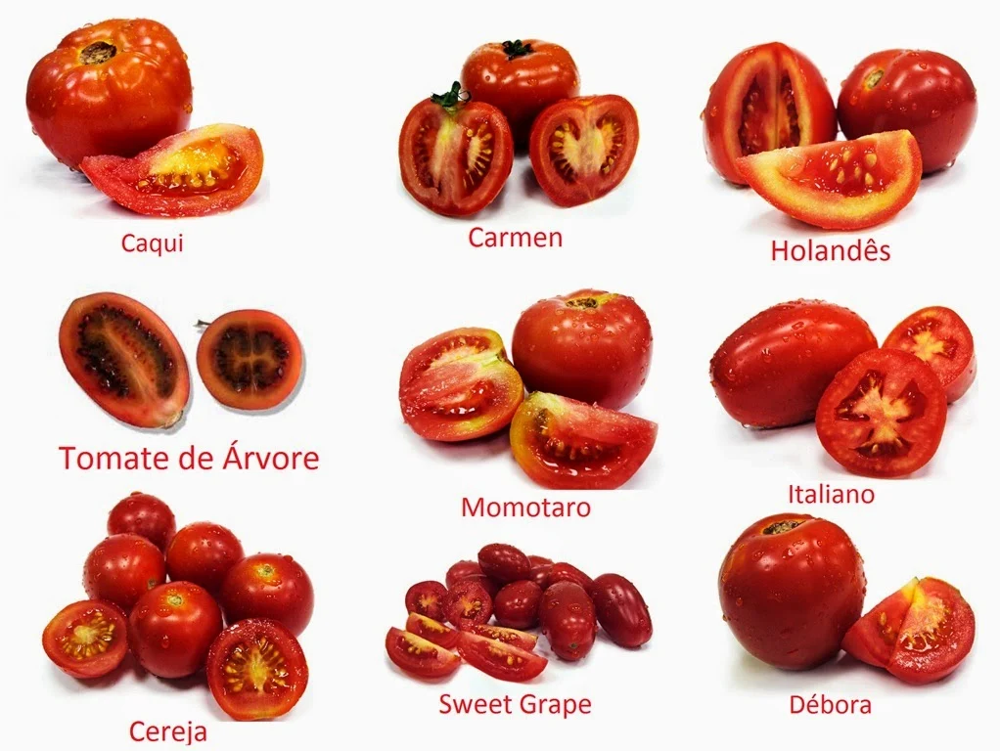
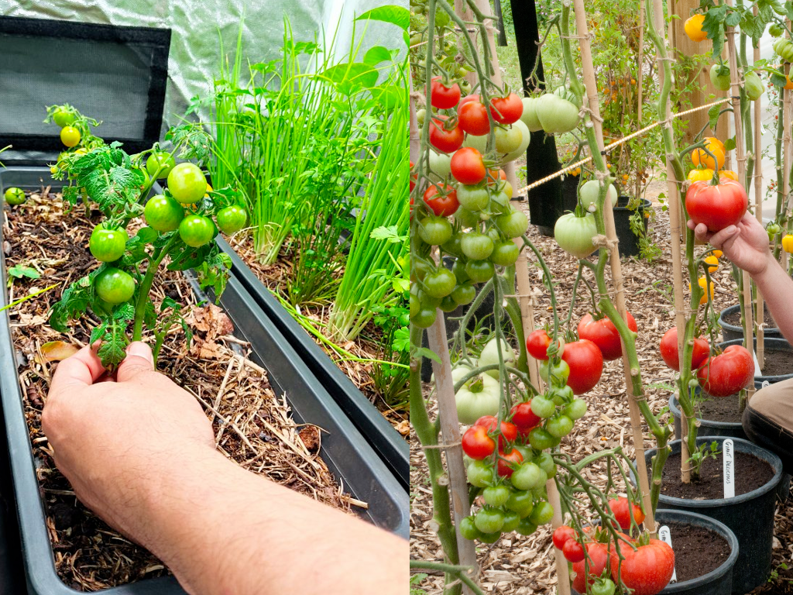
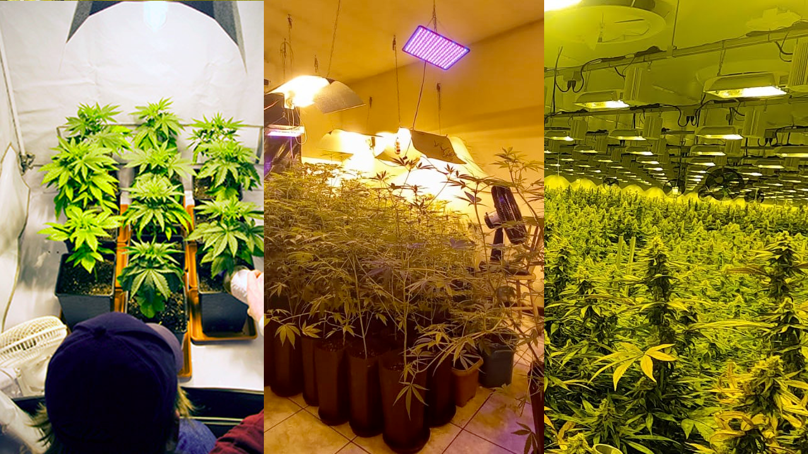
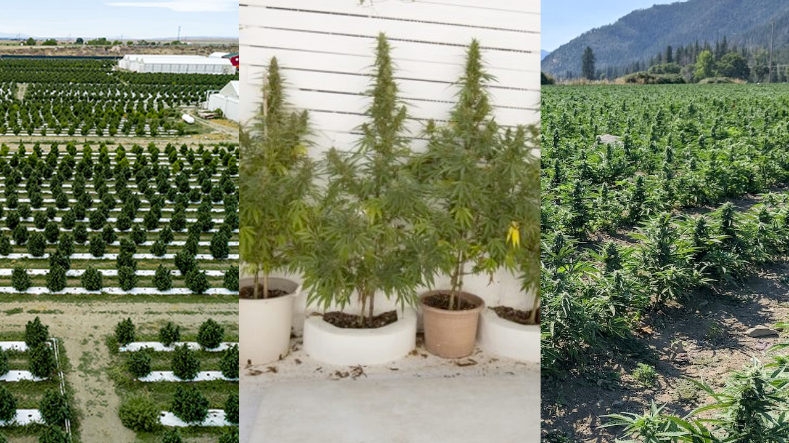

Como o objetivo desse repositório é ajudar vocês a entenderem o básico sobre Cultivo Terapeutico de Canabis. Nada mais justo doque iniciar com os conceitos básicos de Jardinagem, que são amplamente utilizados no cultivo de Maconha e outras várias plantas.

Sabemos que florestas inteiras surgiram "sozinhas" ao redor do mundo, mas com o passar do tempo como vimos na [**Etnobotânica**](../01-historia/README.md) por necessidade muitas plantas foram domesticadas até se tornarem o que são hoje.

Vou passar alguns conceitos que ajudarão vocês a entender como é o processo de vida de uma planta.

## **Escolha sua planta**
Essa escolha parece óbvia e fácil mas não é tanto quanto parece, mesmo que você decida plantar algo comum como um tomate, ainda sim você teria que decidir qual tipo de tomate seria interessante: tomate cereja, tomate italiano, tomate caqui, dentre outros.

Uma coisa que pode ajudar nessa decisão é definir qual espaço disponível pra isso e qual é o objetivo, se será:
- Ornamental
    - floral
    - tamanho controlado
    - externo
    - ...
- Medicinal
    - stress
    - fome
    - insônia
    - dores
    - ...
- Alimentação
    - salada
    - suco
    - molho
    - ...

A partir dessa definição, você terá mais informações das necessidades da sua planta, pois cada planta tem suas necessidades individuais específicas. Mesmo plantas iguais podem ter necessidades diferentes a depender de algumas variações.
 
 

## **Local**
Dito isso, você tem que verificar o ambiente que a sua planta necessita/aceita e o que você tem pra oferecer. Se você já sabe qual planta você deseja cultivar e tem noção do espaço disponível. Isso com certeza irá te orientar a ver se será um cultivo: interno("***indoor***") ou externo("***outdoor***").

Ambas opções tem particularidades, e tem quem goste de variar entre elas. Mas geralmente quem opta pela opção *indoor* é quem tem pouco ou nenhum espaço externo, como é o caso de pessoas que moram em apartamento, e ou quem precisa ter um nível de controle mais específico.

Segue uma breve descrição sobre ambos:

### **Indoor**
O cultivo indoor é quando você cria um ambiente controlado podendo ser desde pequenas estufas, podendo ter alguns maiores como salas ou quartos e até galpões inteiros. 

Nesse método, você tem controle total sobre as condições de crescimento, como a quantidade de luz, temperatura, umidade e circulação de ar. Geralmente, são utilizadas luzes artificiais, como lâmpadas especiais de crescimento, para fornecer a luz necessária às plantas. O cultivo indoor permite cultivar plantas o ano todo, independentemente das condições climáticas externas. É especialmente útil para cultivar plantas que requerem um clima específico ou para quem não tem espaço externo disponível.

- **Prós**:
    - Controle do ambiente (luz, temperatura, umidade, mudanças de clima)
    - Menor incidência de pragas
    - Colheita o ano todo
    - Privacidade

- **Contras**:
    - Custo inicial alto
    - Espaço limitado
    - Alto Consumo energético
    - Exige maior atenção

### **Outdoor**
O cultivo outdoor é quando você cultiva plantas ao ar livre, diretamente no solo ou em recipientes, aproveitando as condições naturais do ambiente. 

Nesse método, as plantas dependem da luz solar, das variações de temperatura e da chuva para crescer. O cultivo outdoor é comum em jardins, quintais ou espaços externos adequados. Ele permite que as plantas se desenvolvam naturalmente e desfrutem das estações do ano, com a luz solar e a brisa ao ar livre. É importante selecionar plantas que se adaptem bem ao clima da sua região e levar em consideração as estações para o plantio e cuidado adequados.

- **Prós**:
    - Menor custo energégico
    - Plantas maiores
    - Maior espaço

- **Contras**:
    - Expoto à pragas
    - Sem controle do ambiente/clima
    - Expoto a chuvas
    - Demora mais a florecer/frutos

 
 

## **Substrato**
O substrato é um termo usado na área da biologia para descrever o ambiente onde uma planta ou organismo vive ou cresce. É como se fosse o solo ou a base em que uma planta é plantada. Substrato é composto por diversos elementos, como solo, areia, argila, matéria orgânica e minerais. Esses componentes juntos formam uma mistura que é ideal para as plantas se enraizarem e obterem os nutrientes de que precisam.

Pense no substrato como a "casa" da planta. Assim como os seres humanos precisam de uma casa para viver, as plantas também precisam de um lugar adequado para crescer. O substrato fornece às plantas os nutrientes, água e suporte físico necessários para seu crescimento saudável. É importante escolher o substrato certo para cada tipo de planta, pois diferentes espécies têm necessidades diferentes. Alguns substratos são mais ricos em nutrientes, enquanto outros são mais drenantes, permitindo que a água passe facilmente mas fornecendo a elas os nutrientes e suporte necessários para se desenvolverem adequadamente. 

Normalmente vemos plantas sendo cultivadas em vasos ou diratamente no solo/chão, e em ambos locais podemos encontrar substratos de 2 tipos principais, os substratos orgânicos e o inerte.  Como meio alternativo de cultivo ainda existe a Hidroponia, apesar de acelerar o desenvolvimento da planta de forma mais controlada e com maior qualidade exige um pouco mais de conhecimento pois aumenta a complexidade em relação a nutrição das plantas já que toda alimentação é depositada diretamente na agua, pois não há solo.

### Organico
O substrato orgânico é composto principalmente por materiais naturais, como restos de plantas, cascas, húmus de minhoca e outros resíduos orgânicos. Esses materiais são decompostos por microrganismos presentes no solo, que os transformam em nutrientes essenciais para as plantas.

Ao contrário de outros tipos de solo, o substrato orgânico é rico em nutrientes, possui uma boa capacidade de retenção de água e permite uma boa circulação de ar. Isso cria um ambiente favorável para o crescimento das raízes das plantas, além de ajudar a manter a umidade necessária.

Uma das vantagens do uso de substrato orgânico é que ele é mais sustentável e amigável ao meio ambiente, uma vez que utiliza materiais reciclados e evita o uso de produtos químicos sintéticos. Além disso, o substrato orgânico pode melhorar a estrutura do solo a longo prazo, promovendo a saúde do ecossistema e contribuindo para a conservação da biodiversidade.

### Inerte
Um substrato inerte é um material que não contém nutrientes ou substâncias que as plantas possam absorver para seu crescimento. Em outras palavras, é um material "neutro" em termos de fornecimento de nutrientes para as plantas.

Por que alguém usaria um substrato inerte então? Bem, existem algumas razões. Primeiro, em alguns casos, as plantas podem precisar de um ambiente específico para crescer adequadamente, como em cultivos hidropônicos, onde as raízes ficam imersas em uma solução nutritiva e não precisam de substrato.

Além disso, alguns cultivadores preferem usar substratos inertes porque oferecem maior controle sobre os nutrientes fornecidos às plantas. Dessa forma, eles podem ajustar a quantidade e o tipo de nutrientes com precisão, para atender às necessidades específicas de cada planta.

Um exemplo comum de substrato inerte é a fibra de coco, que é uma alternativa à terra e é frequentemente usada em cultivos hidropônicos ou em vasos onde se deseja ter um controle maior sobre os nutrientes.

### Hidroponia 
A hidroponia é um método de cultivo de plantas em que as raízes não estão no solo, mas em um meio líquido nutritivo. Em vez de obter nutrientes do solo, as plantas recebem uma solução nutritiva diretamente na água em que estão imersas.

Basicamente, a hidroponia permite cultivar plantas sem solo, usando água e nutrientes dissolvidos. O objetivo é fornecer às plantas tudo o que elas precisam para crescer e se desenvolver, sem depender da terra.

Existem diferentes sistemas de hidroponia, mas todos eles envolvem a criação de um ambiente controlado, onde a água, a luz, a temperatura e os nutrientes são ajustados para atender às necessidades das plantas. Isso permite um maior controle sobre as condições de crescimento e resulta em cultivos mais eficientes e produtivos.

A hidroponia oferece várias vantagens, como um uso mais eficiente da água, a eliminação de problemas relacionados ao solo, o controle preciso dos nutrientes fornecidos às plantas e a possibilidade de cultivar alimentos em locais onde o solo é inadequado para a agricultura tradicional.

 
 

## **Alimentação**
- Micro/Macro nutrientes

### Rega

### NPK

### Fertilizantes

 
 

## **Poda**

 
 

## **MIP - Pragas**

 
 

## **Fases**

 
 

## **Evolução**

