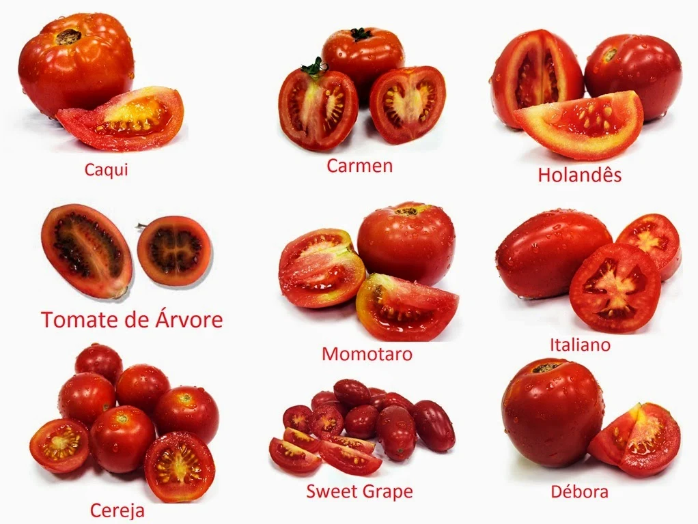

Como o objetivo desse repositório é ajudar vocês a entenderem o básico sobre Cultivo Terapeutico de Canabis. Durante o decorrer desse passo a passado iremos ver conceitos básicos de **Jardinagem**, que são amplamente utilizados no cultivo de várias plantas incluindo Maconha.

Sabemos que florestas inteiras surgiram "sozinhas" ao redor do mundo, mas com o passar do tempo como vimos na [**Etnobotânica**](../../01-base/01-historia/README.md), muitas plantas foram domesticadas por necessidade até se tornarem o que são hoje.

Vou passar alguns conceitos que ajudarão vocês a entender como é o processo de vida de uma planta.

### **Escolha sua planta**
Essa escolha parece óbvia e fácil mas não é tanto quanto parece, mesmo que você decida plantar algo comum como um tomate (que segundo especialistas é muito parecido do processo de cultivar maconha), ainda sim você teria que decidir qual tipo de tomate seria interessante: tomate cereja, tomate italiano, tomate caqui, dentre outros.

Uma coisa que pode ajudar nessa decisão é definir qual espaço disponível pra isso e qual é o objetivo, se será:

- **Ornamental**
    - floral
    - tamanho controlado
    - externo
    - ...
    

    
    

- **Medicinal**
    - stress
    - fome
    - insônia
    - dores
    - ...
    

    
    

- **Alimentação**
    - salada
    - suco
    - molho
    - ...
    

    
    

A partir dessa definição, você terá mais informações das necessidades da sua planta, pois cada planta tem suas necessidade individual específica. Mesmo plantas iguais podem ter necessidades diferentes a depender de algumas variações.

 
 
Agora vamos definir o [**local**](../01-local/README.md)
 

