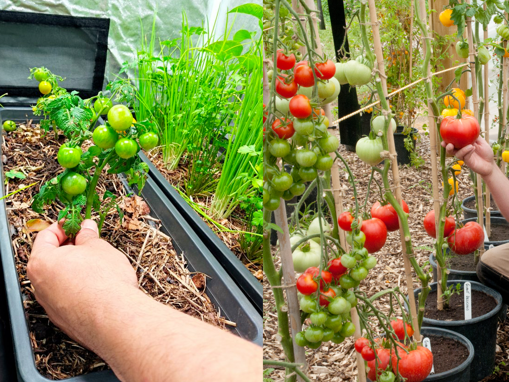
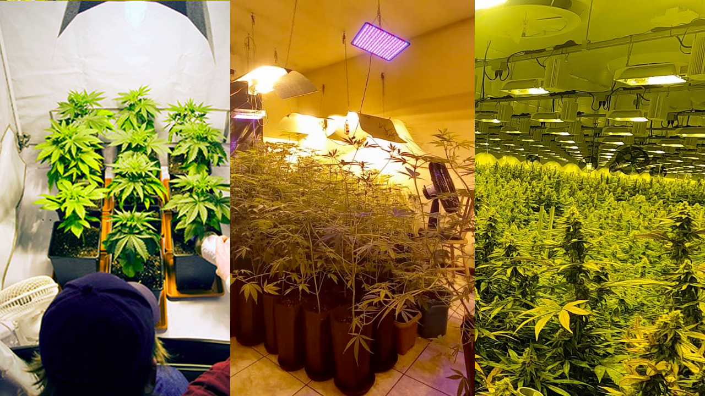
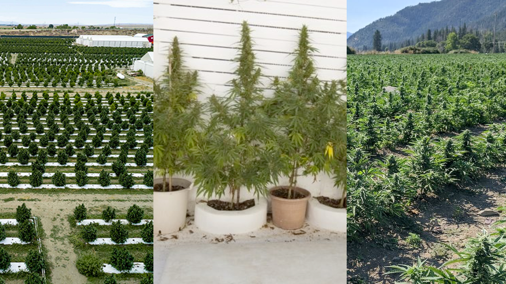

Dito isso, você tem que verificar o ambiente que a sua planta necessita/aceita e o que você tem pra oferecer. Se você já sabe qual planta você deseja cultivar e tem noção do espaço disponível. Isso com certeza irá te orientar a ver se será um cultivo: interno("***indoor***") ou externo("***outdoor***").

Ambas opções tem particularidades, e tem quem goste de variar entre elas. Mas geralmente quem opta pela opção *indoor* é quem tem pouco ou nenhum espaço externo, como é o caso de pessoas que moram em apartamento, e ou quem precisa ter um nível de discrição ou controle mais específico.

Segue uma breve descrição sobre ambos:

### **Indoor**
O cultivo indoor é quando você cria um ambiente controlado podendo variar desde pequenas estufas, podendo ter alguns maiores como salas ou quartos e até galpões inteiros. 

Nesse método, você tem controle total sobre as condições do ambiente, como a quantidade de luz, temperatura, umidade e circulação de ar. Geralmente, são utilizadas luzes artificiais, como lâmpadas especiais de crescimento, para fornecer a luz necessária às plantas. O cultivo indoor permite cultivar plantas o ano todo, independentemente das condições climáticas externas. É especialmente útil para cultivar plantas que requerem um clima específico ou como já mencionado, para quem não tem espaço externo disponível.

- **Prós**:
    - Controle do ambiente (luz, temperatura, umidade, mudanças de clima)
    - Menor incidência de pragas
    - Colheita o ano todo
    - Privacidade

- **Contras**:
    - Custo inicial alto
    - Espaço limitado
    - Alto Consumo energético
    - Exige maior atenção

### **Outdoor**
O cultivo outdoor é quando você cultiva plantas ao ar livre, diretamente no solo ou em vasos, aproveitando as condições naturais do ambiente. 

Nesse método, as plantas dependem da luz solar, das variações de temperatura e da chuva para crescer. O cultivo outdoor é comum em jardins, quintais ou espaços externos adequados. Ele permite que as plantas se desenvolvam naturalmente e desfrutem das estações do ano, com a luz solar e a brisa ao ar livre. É importante selecionar plantas que se adaptem bem ao clima da sua região e levar em consideração as estações para o plantio e cuidado adequados.

- **Prós**:
    - Menor custo energético
    - Plantas maiores
    - Maior espaço

- **Contras**:
    - Expoto à pragas
    - Sem controle do ambiente/clima
    - Expoto a chuvas
    - Demora mais a florecer/frutos
    - Para manter o foto período, eventualmente será necessário a utilização de luzes artificiais