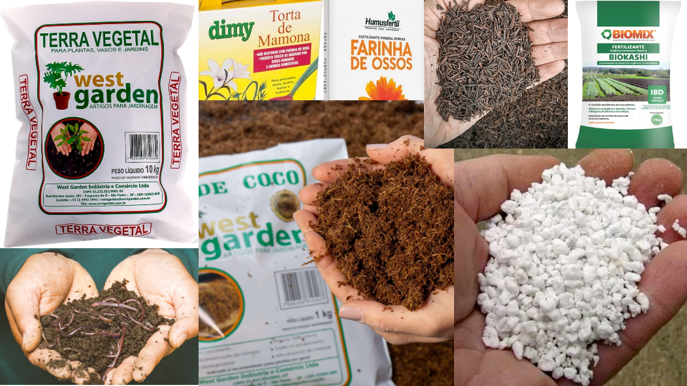
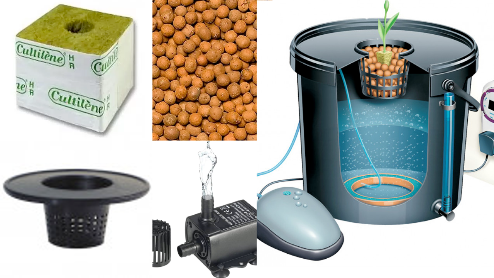

O substrato é um termo que descreve o ambiente onde uma planta ou organismo vive ou cresce. É como se fosse o solo ou a base em que uma planta é "plantada". Substrato é composto por diversos elementos, como: areia, argila, matéria orgânica, minerais dentre dezenas de outros. Esses componentes juntos formam uma mistura que é ideal para que as plantas se enraizem e obtenham os nutrientes de que precisam.

Pense no substrato como a "casa" da planta. Assim como os seres humanos precisam de uma casa para viver, as plantas também precisam de um lugar adequado para crescer. O substrato fornece às plantas os nutrientes, água e suporte físico necessários para seu crescimento saudável. É importante escolher o substrato certo para cada tipo de planta, pois diferentes espécies têm necessidades diferentes. Alguns substratos são mais ricos em nutrientes, outros mais intertes, enquanto outros são mais drenantes permitindo que a água passe facilmente ou podendo ser ótimos retetores de umidade, podendo ser adequada para as necessidades individuais da sua planta para atenda e suporte tudo necessário para que se desenvolva adequadamente. 

Normalmente vemos plantas sendo cultivadas em vasos ou diratamente no solo/chão, e em ambos locais podemos encontrar substratos de 2 tipos principais, os substratos orgânicos e o inertes.  Como meio alternativo de cultivo ainda existe a Hidroponia, apesar de acelerar o desenvolvimento da planta de forma mais controlada e com maior qualidade exige um pouco mais de conhecimento pois aumenta a complexidade em relação a nutrição das plantas já que toda alimentação é depositada diretamente na agua, pois não há solo.

 

Alguns pontos importantes para o substrato, independente de qual tipo você escolha são que:

- **Tem que ser bastante aerado facilitando a troca de ar/oxigênio**

    Ou seja não pode ser rígido ou argiloso

- **Solo tem que ser bem drenante**

    Não tem problema em receber muita água desde que não acumule muito formando lama ou "empapando" o substrato

 

Outra informação importante é que você pode notar que alguns itens fazem parte tanto do orgânico quanto do inerte, ex:

- **Perlita**, é um material leve propõe aeração ao substrato, não retetor de água, semelhante a isopor, porem é de origem mineral.
- **Vermiculita**, semalhante a Perlita, porem retem mais água e também tem origem mineral.
- **Turfa de Sphagnum**, apesar de vir de origem vegetal(musgo) é um material inerte e leve.
- **Pó de coco**, assim como Turfa vem de origem vegetal, mas também é considerado um material inerte, leve e reutilizável.
- **Casca de arroz carbonizada**, propõe um substrato leve e poroso, ideal para enraizamento e também de origem vegeral mas considerado inerte.

 
 

### **Organico**    
O substrato orgânico é composto principalmente por materiais naturais, como restos de plantas, terra vegetal, cascas, húmus de minhoca e outros resíduos orgânicos. Esses materiais são decompostos por microrganismos presentes no solo, que os transformam em nutrientes essenciais para as plantas.

Ao contrário de outros tipos de solo, o substrato orgânico é rico em nutrientes, possui uma enorme vida microbiana acumulada além da capacidade de retenção de água e permite uma boa circulação de ar. Isso cria um ambiente favorável para o crescimento das raízes das plantas, além de ajudar a manter a umidade necessária.

Uma das vantagens do uso de substrato orgânico é que ele é mais sustentável e amigável ao meio ambiente, uma vez que utiliza materiais reciclados e evita o uso de produtos químicos sintéticos. Além disso, o substrato orgânico pode melhorar a estrutura do solo a longo prazo, promovendo a saúde do ecossistema e contribuindo para a conservação da biodiversidade.

 

### **Inerte**
Um substrato inerte é um material que não contém nutrientes ou substâncias que as plantas possam absorver para seu crescimento. Em outras palavras, é um material "neutro" em termos de fornecimento de nutrientes para as plantas.

Por que alguém usaria um substrato inerte então? Bem, existem algumas razões. Primeiro, em alguns casos, as plantas podem precisar de um ambiente específico para crescer adequadamente, como em cultivos hidropônicos, onde as raízes ficam imersas em uma solução nutritiva e não precisam de substrato.

Além disso, alguns cultivadores preferem usar substratos inertes porque oferecem maior controle sobre os nutrientes fornecidos às plantas. Dessa forma, eles podem ajustar a quantidade e o tipo de nutrientes com precisão, para atender às necessidades específicas de cada planta.

Um exemplo comum de substrato inerte é a fibra de coco, que é uma alternativa à terra e é frequentemente usada em cultivos hidropônicos ou em vasos onde se deseja ter um controle maior sobre os nutrientes.

 

### **Semi-Inerte (Bônus)**
O solo semi-inerte é uma combinação de solo inerte com solo orgânico. Ele contém uma porção de materiais inertes, que proporcionam aeração e drenagem, e uma porção de matéria orgânica, que fornece nutrientes para as plantas. Essa mistura equilibra a disponibilidade de nutrientes e a capacidade de retenção de água.

A idéia por trás do solo semi-inerte é ter um bom controle da nutrição assim como no solo inerte, mas ao mesmo tempo ter uma ajuda da vida microbiana presente no humus e materia orgânica. Muitos pesquisadores acreditam que isso ajuda a planta em questões de micronutrientes, aumentando a eficiência, reduzindo problemas no solo, pestes e doenças.

 

### **Hidroponia (Bônus +1)**
A hidroponia é um método de cultivo de plantas em que as raízes não estão no solo, mas em um meio líquido nutritivo. Em vez de obter nutrientes do solo, as plantas recebem uma solução nutritiva diretamente na água em que estão imersas.

Basicamente, a hidroponia permite cultivar plantas sem solo, usando água e nutrientes dissolvidos. O objetivo é fornecer às plantas tudo o que elas precisam para crescer e se desenvolver, sem depender da terra.

Existem diferentes sistemas de hidroponia, mas todos eles envolvem a criação de um ambiente controlado, onde a água, a luz, a temperatura e os nutrientes são ajustados para atender às necessidades das plantas. Isso permite um maior controle sobre as condições de crescimento e resulta em cultivos mais eficientes e produtivos.

A hidroponia oferece várias vantagens, como um uso mais eficiente da água, a eliminação de problemas relacionados ao solo, o controle preciso dos nutrientes fornecidos às plantas e a possibilidade de cultivar alimentos em locais onde o solo é inadequado para a agricultura tradicional.

 
 
 