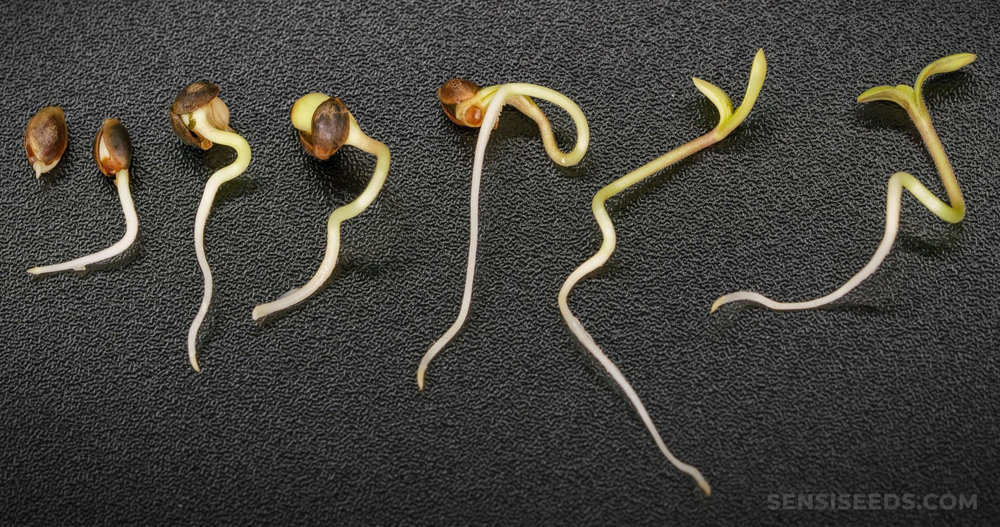
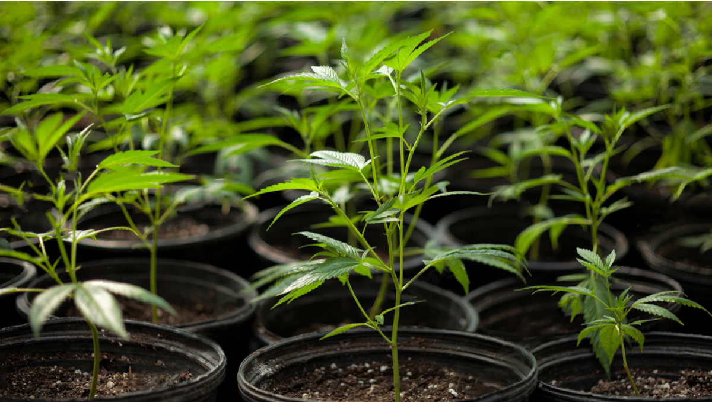
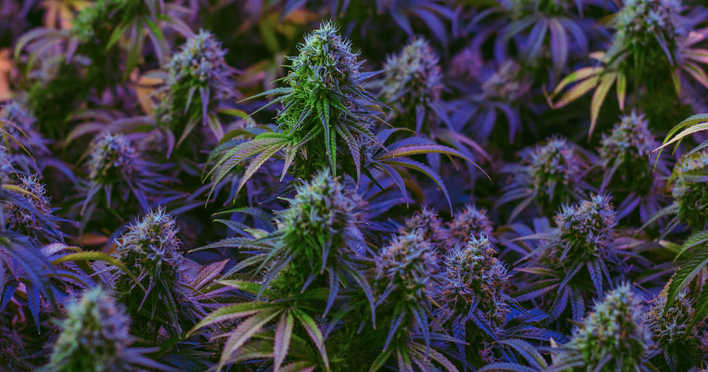

## **Germinacao (Germination/Seedling)**

Este é o estágio inicial da vida da planta, quando uma semente de cannabis começa a brotar. A semente absorve água, inicia a divisão celular e emerge da casca como uma plântula.

- **Tempo**: O estágio de germinação começa quando uma semente de cannabis absorve água e inicia o processo de germinação. Isso pode levar de 1 a 7 dias, dependendo da genética da semente e das condições ambientais.
- **Cuidados**: Para germinar sementes com sucesso, coloque-as em um ambiente úmido e quente, como entre duas folhas de papel toalha úmido. Mantenha a umidade e temperatura constantes. Após a germinação, a plântula tem um caule frágil e deve ser manuseada com cuidado.
- **Iluminação**: Neste estágio, as plântulas precisam de luz constante, mas a intensidade luminosa pode ser relativamente baixa.

## **Vegetativo (Vegetation)**

Após a germinação, a planta entra na fase vegetativa. Durante esse estágio, a planta cresce rapidamente, desenvolvendo folhas, caules e raízes. Ela requer uma quantidade significativa de luz, especialmente luz branca (azul), para promover o crescimento vegetativo.

- **Tempo**: A fase vegetativa continua até que a planta atinja o tamanho desejado. Isso pode variar de algumas semanas a vários meses, dependendo do seu objetivo de cultivo.
- **Crescimento**: Durante esta fase, a planta concentra-se no crescimento de folhas, caules e raízes. A folhagem é geralmente verde escura e densa, e a planta tende a crescer verticalmente.
- **Iluminação**: As plantas em crescimento vegetativo requerem luz constante com um espectro de luz rico em azul e vermelho (luz branca). Um ciclo de luz de 18-24 horas por dia é comum.
- **Nutrição**: As plantas vegetativas requerem níveis mais elevados de nitrogênio (N) em comparação com outros nutrientes para promover o crescimento verde e saudável.

## **Floracao (Flowering/Bloom)**

A floração é o estágio em que as plantas desenvolvem suas flores. O fotoperíodo de luz deve ser ajustado para cerca de 12 horas de luz e 12 horas de escuridão diariamente para induzir a floração. As plantas de cannabis fêmeas produzem flores, que contêm os brotos de maconha desejados. Este estágio é essencial para a produção de colheita.

- **Tempo**: A floração começa quando a planta é submetida a um fotoperíodo de 12 horas de luz e 12 horas de escuridão diariamente. A fase de floração pode durar de 6 a 14 semanas, dependendo da variedade da planta.
- **Desenvolvimento de Flores**: Durante a floração, as plantas começam a desenvolver flores, que contêm os brotos desejados. O crescimento se concentra nas flores, e a planta pode parar de crescer verticalmente.
- **Iluminação**: Durante a floração, as plantas de cannabis precisam de um espectro de luz mais rico em vermelho e menos luz branca. A transição para um ciclo de 12/12 inicia a floração.
- **Nutrição**: As necessidades nutricionais mudam na fase de floração, com ênfase em fósforo (P) e potássio (K) para promover a formação de flores e brotos densos.

