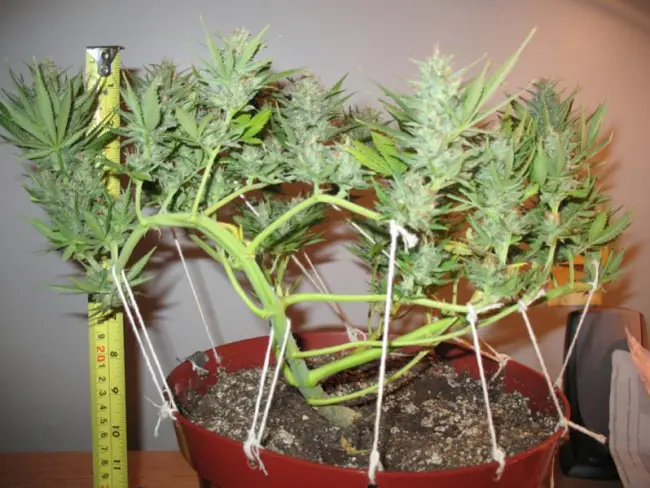
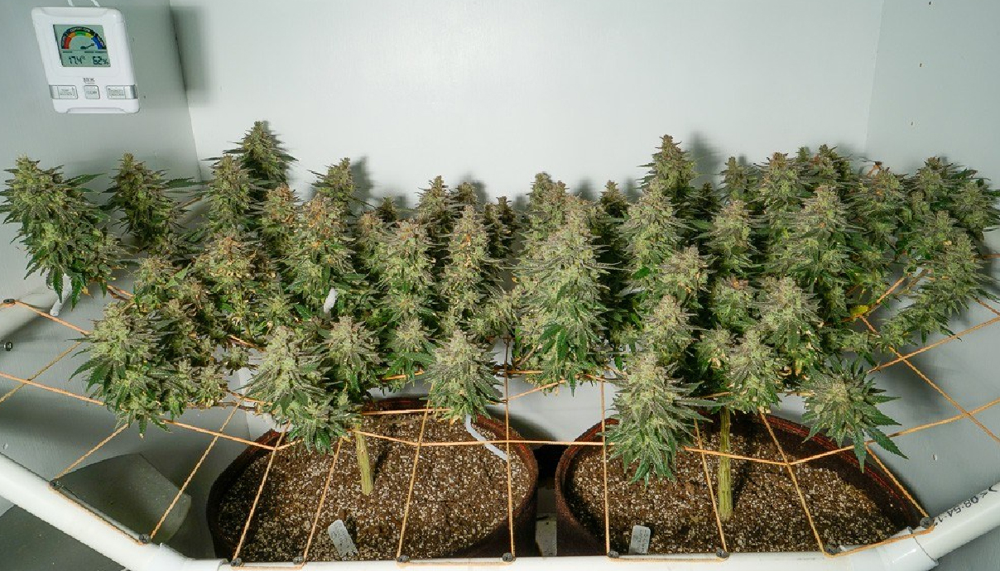
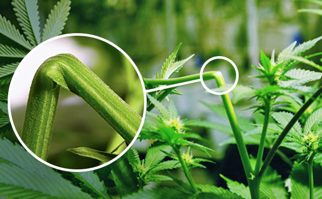
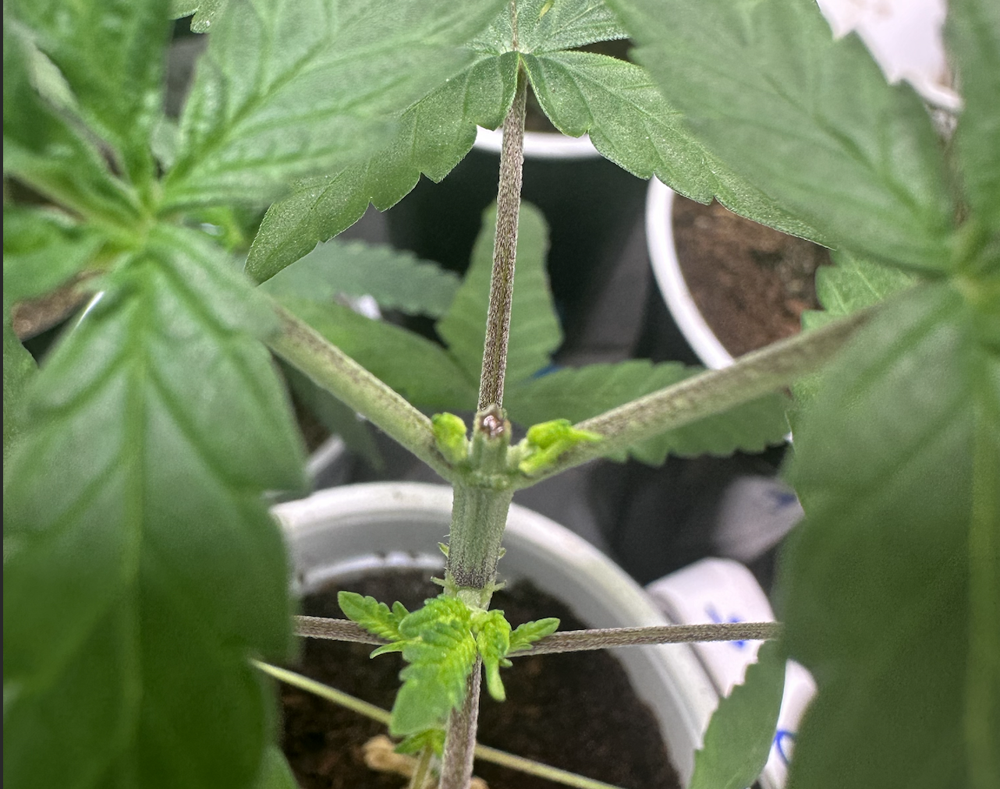
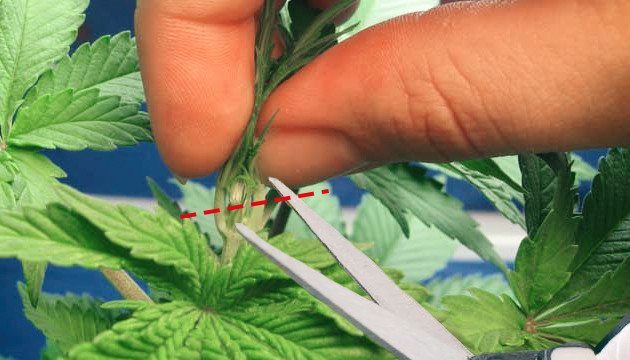
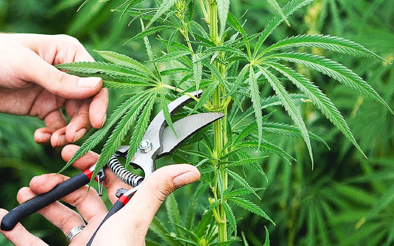
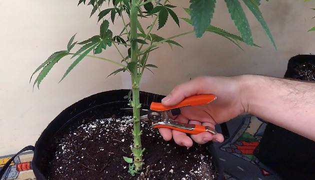

## **LST**

A técnica de **"LST" (Low-Stress Training/Treinamento de Baixo Stress)** é uma técnica de treinamento de plantas de cannabis que visa controlar o crescimento e direcionar o desenvolvimento das plantas de forma a otimizar a exposição à luz e melhorar o rendimento. A principal característica do LST é que ele aplica um estresse mínimo às plantas. O LST é mais eficaz durante a fase vegetativa, antes de as plantas entrarem na fase de floração. Comece a técnica quando as plantas tiverem algumas semanas de crescimento vegetativo.

- **Amarras**: Amarras são dispositivos usados no cultivo de plantas para direcionar seu crescimento, otimizando a exposição à luz e aumentando a produção. 

- **Scrogging (Screen of Green)**: O Scrogging é uma técnica que utiliza uma tela (ou treliça) para criar um dossel plano e uniforme. Os ramos são treinados para crescer horizontalmente pela tela, permitindo que todos os brotos recebam luz igualmente.

- **Super Cropping**: Essa técnica envolve dobrar e esmagar suavemente os ramos principais para estimular o crescimento lateral. Super cropping pode ser usado para controlar a altura da planta e criar um dossel mais uniforme.

## **HST**

O **High-Stress Training (HST)/Treinamento de Alto Stress** é uma técnica de treinamento de plantas de cannabis que envolve a aplicação de estresse controlado às plantas para manipular seu crescimento e aumentar a produção de brotos. Diferentemente do (LST), que é menos invasivo, o HST pode envolver métodos mais drásticos que podem incluir podas e dobras de ramos. Aqui estão algumas informações importantes sobre HST:

- **Poda de Apical**: A poda de apical é semelhante à poda principal, mas envolve a remoção de todo o ápice do broto principal entre nós do caule, em vez de apenas uma parte. Isso resulta em um novo ponto de crescimento no topo da planta.

- **Poda FIM (Fimming)**: Fimming é uma técnica de poda em que parte do topo do broto principal é cortada. Isso resulta no crescimento de vários ramos laterais em vez de apenas dois, criando uma planta mais densa.

- **Poda de Desbaste/Defolhação**: Nesta técnica, parte das folhas que não contribuem para o o crescimento da planta, ou bloqueiam muita luz para os ramos mais abaixo, são removidos para concentrar a energia da planta nas partes superiores e que as partes inforiores recebam mais luz.

- **Poda Lollipop**: o lollipop envolve a remoção de ramos inferiores que não recebem luz suficiente, para que a planta foque sua energias nos TOP BUDs e nao gaste energia para produzir uma flor com baixo rendimento.

